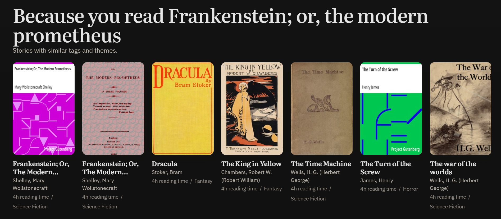
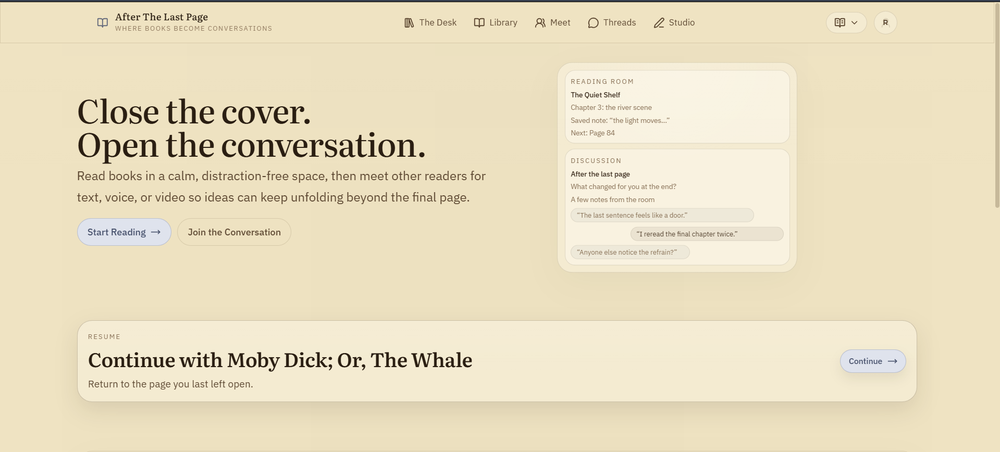
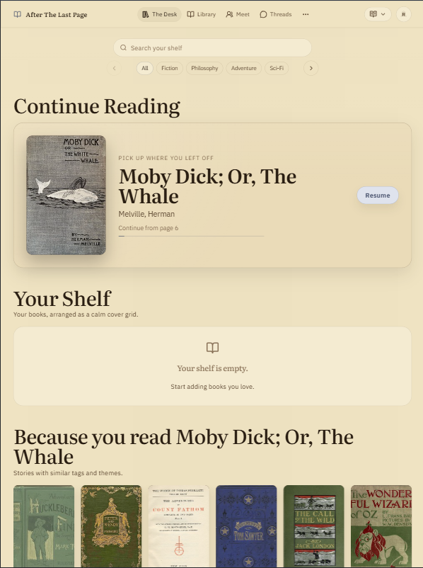
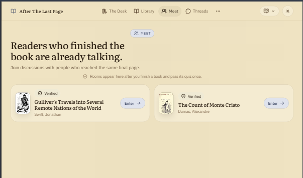
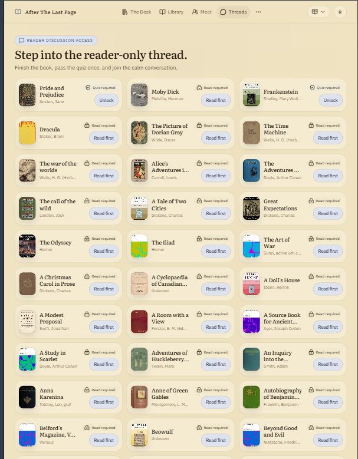

<<<<<<< HEAD
# After The Last Page

## Demo









After The Last Page is a reading platform inspired by Kindle-like interfaces, but with a small social twist that activates **after you finish a book**.

**GitHub Repo:**  
https://github.com/V-Rytham/After-The-Last-Page

---

## Idea Behind the Project

Often when someone finishes a great book, the first instinct is to talk about it. But in reality it’s hard to find someone who:

- has read the same book
- finished it recently
- is interested in discussing it in depth

This project is an attempt to solve that problem while keeping the reading experience calm and minimal, similar to traditional e-readers.

---

## Features

### 1. Book Reading (Kindle-style Interface)

Users can read books directly inside the app.

The reader interface is designed to feel similar to Kindle or Apple Books, focusing on:

- clean typography
- minimal distractions
- comfortable long reading sessions

Available themes:

- Light
- Sepia
- Dark

---

### 2. Meet Other Readers

Once someone finishes a book, they can connect with other readers who also completed the same book recently.

Communication options include:

- Text chat
- Voice conversation
- Video conversation

Some simple checks are used to make sure the discussions remain meaningful:

- a minimum reading time requirement, or
- a short **5-question quiz** about the book

The goal is not to test memory perfectly, but just to confirm the person actually read the book.

Users also stay anonymous from our side to keep interactions more comfortable and reduce social pressure.

---

### 3. BookThread (Discussion Rooms)

Each book has its own discussion space.

Readers who complete the quiz can:

- start discussion threads
- reply to existing conversations

The idea is similar to small **Reddit or Discord-style discussions**, but focused on a single book.

---

### 4. Merchandise Generator ("Wizard")

The platform also includes a small AI assistant called **Wizard** that helps readers create book-inspired merchandise.

Users can:

- describe a design idea
- generate a visual concept
- customize it for items like **t-shirts or hoodies**

The generated design can then be prepared for production and delivery.

---

## Tech Stack

### Frontend
- Vite
- React
- React Router

### Backend
- Node.js
- Express

### Database
- MongoDB (Mongoose)

### Realtime Communication
- Socket.IO

---

## Running the Project Locally

### Prerequisites

- Node.js (LTS recommended)
- MongoDB running locally

Default database connection:

```
mongodb://localhost:27017/after_the_last_page
```

---

### 1. Install Dependencies

Frontend:

```bash
cd "D:\After The Last Page"
npm install
```

Backend:

```bash
cd "D:\After The Last Page\backend"
npm install
```

---

### 2. Setup Environment Variables

Copy the example file:

```bash
copy "D:\After The Last Page\backend\.env.example" "D:\After The Last Page\backend\.env"
```

Then edit the values if required (JWT secret, database URL, etc).

---

### 3. Start the Application

Run backend:

```bash
cd "D:\After The Last Page"
node backend\index.js
```

Run frontend:

```bash
npm run dev -- --host
```

Run both together:

```bash
npm run dev:full
```

Run all services (main API + BookFriend + frontend):

```bash
npm run dev:all
```

The frontend usually detects the API automatically if everything is on the same network, but you can set `VITE_API_URL` manually if needed.

For Render deployments, make sure the main API can reach the BookFriend service with `BOOKFRIEND_SERVER_URL`. If that variable is omitted, local development still works because the backend falls back to `http://127.0.0.1:5050`, but deployed containers need the public Render URL (for this blueprint, `https://alp-bookfriend.onrender.com`).

---

## Project Documentation

Additional design and architecture notes are available in these files:

- `DESIGN_SYSTEM.md`
- `READING_INTERFACE.md`
- `LIBRARY_INTERFACE.md`
- `BOOKTHREAD_INTERFACE.md`

---

## Deployment Note

If you deploy the frontend as a static site, make sure your host rewrites routes back to `index.html`.

Otherwise refreshing routes like:

```
/read/:bookId
```

may show a **Not Found** error.

Example:

- Render configuration → see `render.yaml`
- Render root directories should be `backend`, `bookfriend-server`, and `frontend` for the three services in this repo
- Static hosts → `_redirects` file is included and copied during build

---

## Planned Improvements

Some things planned for the next iterations:

- expanding the book catalog
- improving authentication and deployment setup
- better matching logic for reader conversations
- moderation and anti-abuse mechanisms
- improving the merch generation pipeline

---

## BookFriend Agent Server

BookFriend runs as a separate service inside:

```
bookfriend-server/
```

It connects to the main API through proxy endpoints:

```
/api/agent/*
```

More details about the architecture and API contracts can be found in:

```
BOOKFRIEND_INTERFACE.md
```

---

## Local LLM Setup (Free Option)

BookFriend can run using a local LLM through **Ollama**.

Install the model:

```bash
ollama pull llama3.1:8b-instruct-q4_K_M
```

Then configure:

`bookfriend-server/.env`

```env
BOOKFRIEND_LLM_PROVIDER=ollama
BOOKFRIEND_OLLAMA_URL=http://127.0.0.1:11434/api/chat
BOOKFRIEND_OLLAMA_MODEL=llama3.1:8b-instruct-q4_K_M
```

The retrieval system uses a lightweight **in-memory vector index**, so no external vector database is required.

---

## Groq LLM Setup (Hosted Option)

BookFriend can also run against Groq's OpenAI-compatible chat endpoint.

Create `bookfriend-server/.env`:

```env
BOOKFRIEND_LLM_PROVIDER=groq
BOOKFRIEND_GROQ_MODEL=llama-3.1-8b-instant
GROQ_API_KEY=your_key_here
```
=======
# After_the_last_page
This repo contains 3 branches, rytham_codebase, sahas_codebase and main
>>>>>>> 133cc65788cb124174c90dcc4610f4a7f3a42870
